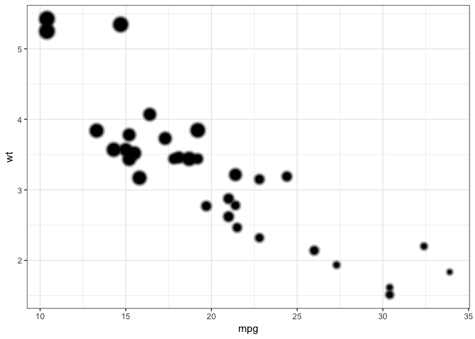
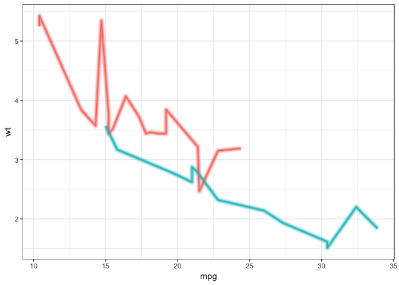
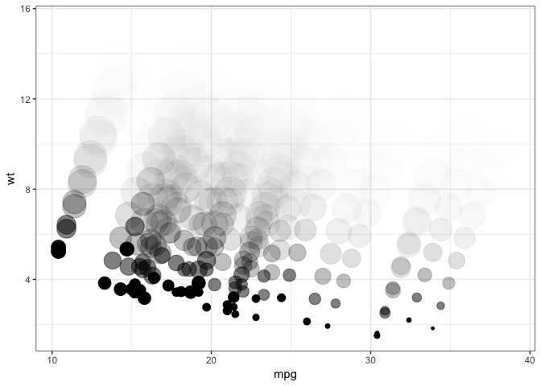

<!-- README.md is generated from README.Rmd. Please edit that file -->

# ggecho

<!-- badges: start -->


<!-- badges: end -->

`ggecho` is a `ggplot2` Stat which echoes the plotting data.

This can be used to create a blur effect for `geom_point()`,
`geom_line()` and `geom_text()` (and probably some other geoms where the
`size` parameter directly determines the area of the displayed element).

This ggplot2 stat works by duplicating/echoing the original data passed
to ggplot, and adjusting each data echo by:

  - size (`size_increment`),
  - alpha (`alpha_factor`), and
  - position (`x_offset` & `y_offset`)

This package wouldn’t be possible without:

  - [ggplot2](https://cran.r-project.org/package=ggplot2) by Hadley
    Wickham
  - [Brodie Gaslam’s](https://twitter.com/BrodieGaslam) great guide to
    [ggplot2
    internals](https://htmlpreview.github.io/?https://github.com/brodieG/ggbg/blob/development/inst/doc/extensions.html#stat-compute)
  - [boBRudis’s](https://twitter.com/hrbrmstr) post on [demystifying
    ggplot2](https://rud.is/books/creating-ggplot2-extensions/demystifying-ggplot2.html)

## Installation

You can install thedevelopment version from
[GitHub](https://github.com/coolbutuseless/ggecho) with:

``` r
# install.packages("remotes")
remotes::install_github("coolbutuseless/ggecho")
```

## Simple blurred points and lines

This is a basic example which shows you how to solve a common problem:

``` r
library(ggecho)

ggplot(mtcars) +
  geom_point(aes(mpg, wt, size = disp), stat = "echo") +
  theme_bw() +
  theme(legend.position = 'none')
```



``` r

ggplot(mtcars) +
  geom_line(aes(mpg, wt, colour = as.factor(am)), stat = "echo") +
  theme_bw() +
  theme(legend.position = 'none')
```



``` r

ggplot(mtcars) +
  stat_echo(aes(mpg, wt, size = disp), geom = "point", size_increment = 2, alpha_factor = 0.5, 
            x_offset = 0.5, y_offset = 1, n = 10) +
  theme_bw() +
  theme(legend.position = 'none')
```



## Blurred text

``` r
text_df <- data.frame(x = c(0.3, 0.7), y = c(0.25, 0.25), label = c('hello', '#rstats'))

ggplot(text_df) + 
  geom_text(aes(x, y, label = label), size = 20, stat = 'echo', 
            size_increment = 2, y_offset = 0.0, n = 20, alpha_factor = 0.6) + 
  theme_void() + 
  xlim(0.1, 0.9) + ylim(0.1, 0.4)
```


